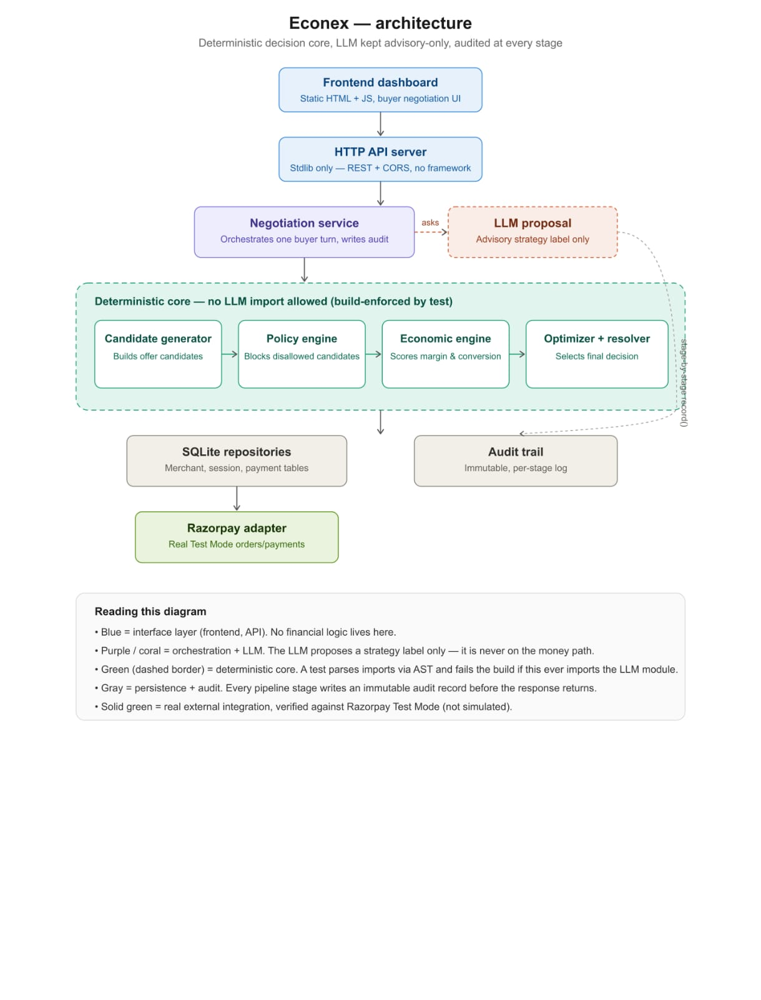

# ECONEX — Architecture

## The one rule everything else follows

> LLM = untrusted language/strategy layer.
> Deterministic core = financial authority.

This is enforced structurally, not just by convention:
`tests/test_architecture_boundary.py` parses the AST of every file in
`app/core/` and fails the build if any of them import `app.llm`,
`app.agents`, `anthropic`, or `openai`. `app/core/razorpay_adapter.py` is
the one file in `core/` that does network I/O (per the product doc's own
repo layout), but even it has zero LLM awareness.

## Module map

```
backend/app/
  core/                          <- deterministic financial authority. NO LLM imports, ever.
    money.py                     integer-paise arithmetic
    domain.py                    shared dataclasses (Product, Candidate, PolicyResult, ...)
    conversion_heuristic.py      synthetic P_conv function
    candidate_generator.py       authoritative source of financial candidates
    policy_engine.py             9 ordered feasibility checks
    economic_engine.py           EOV formula
    optimizer.py                 ranking / selection
    decision_resolver.py         ACCEPT/COUNTER/REJECT/ESCALATE
    state_machine.py             negotiation state transitions
    razorpay_adapter.py          real Test Mode REST calls or [SIMULATION]

  llm/                           the untrusted layer
    provider.py                  StrategyProposal type (no financial fields), schema validation
    mock_provider.py             deterministic offline provider
    claude_provider.py           real Anthropic API call via urllib

  agents/                        strategy proposers, not financial authorities
    cart_recovery_agent.py
    retention_agent.py
    dynamic_discount_agent.py
    router.py                    picks the relevant agent, never fabricates on LLM failure

  repositories/                  sqlite3 persistence, one module per entity group
  schemas/serializers.py         buyer-view (allowlist) vs merchant-view (full) — the privacy firewall
  api/server.py                  stdlib http.server JSON API
  services/negotiation_service.py  wires DB + audit + agents + app.pipeline together
  pipeline.py                    pure orchestration: generate -> policy -> economics -> select -> decide
  benchmark.py                   seeded synthetic benchmark
  redteam.py                     17 adversarial scenarios
  audit.py                       append-only audit trail
  database.py                    SQLite schema (12 entities)
  config.py                      env-var based configuration, no hardcoded secrets

frontend/index.html              vanilla HTML/JS/CSS dashboard, no build step
```


## Why `app.pipeline` exists

Both the live API (`services/negotiation_service.py`) and the offline
benchmark/red-team harnesses call the exact same `run_pipeline()` function.
This guarantees the demo, the tests, and the benchmark can never silently
diverge from each other — there's one code path from intent to decision,
not two similar-but-different ones.

## Data flow for one buyer message

1. `POST /buyer-intents` hits `app/api/server.py`, which authenticates the
   merchant token, then delegates to `services/negotiation_service.py`.
2. The service loads `Product`/`MerchantPolicy` from SQLite
   (`repositories/merchant_repo.py`).
3. It asks the agent router (`agents/router.py`) for a `StrategyProposal` —
   best-effort; on LLM failure, it falls back to a clearly-labeled `NONE`
   strategy and continues (doc section 12: never fabricate a fake success).
4. It builds a `BuyerIntent` and calls `app.pipeline.run_pipeline()` — pure,
   deterministic, no I/O.
5. Every stage is written to `audit_events` (`app/audit.py`).
6. All candidates are persisted to `offers` (for the dashboard's ledger).
7. The `Decision` and new `NegotiationState` are persisted; the buyer only
   ever receives `serializers.buyer_view_offer()`'s allowlisted output.

## The privacy boundary

`app/schemas/serializers.py::buyer_view_offer()` is an **allowlist**, not a
denylist — it names every field it copies. `assert_no_private_leak()` is
called by the API layer right before sending a buyer-facing response, and
raises if any non-allowlisted key is present. This means a future change
that accidentally merges merchant fields into a buyer payload fails loudly
in tests/at runtime, instead of shipping a silent privacy leak.

## Idempotency

`payments` has a `UNIQUE` constraint on `idempotency_key`
(`app/database.py`). `repositories/payments_repo.py::process_payment()` is
the single correct entry point: it checks for an existing row with that
key before ever calling the Razorpay adapter, so a retried request can
never create two real orders.

## State machine

`app/core/state_machine.py` defines the *only* legal transitions as an
explicit frozenset of `(from, to)` pairs. There is deliberately no
`PENDING_APPROVAL -> CLOSED_ACCEPTED` transition — approval must always
pass through `APPROVED` first. This is what makes ESCALATE "a real state,
not a dead-end string" (doc section 11) and makes bypass structurally
impossible rather than merely policy-discouraged.
